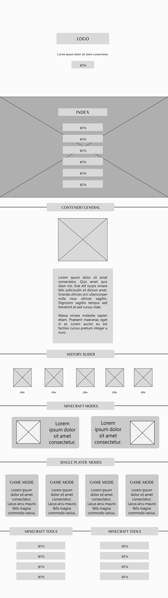
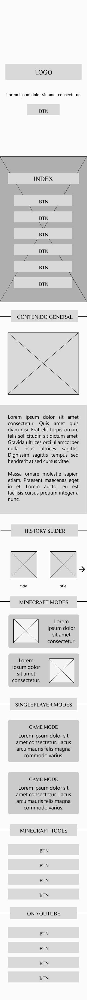

## Autor
- [Jaider Steeven Mendoza Cardona](https://github.com/Dabrox02)

# PROYECTO LANDING PAGE MINECRAFT
Minecraft, un fenómeno global en el mundo de los videojuegos, es un juego de construcción y aventuras que permite a los jugadores explorar mundos infinitos, reunir recursos y desplegar su creatividad sin límites. Desarrollado por Mojang Studios, Minecraft se distingue por su estética pixelada y su libertad total para crear y sobrevivir en un universo en constante evolución

### Objetivo
El objetivo de este proyecto es diseñar y desarrollar una landing page de Minecraft que, de manera atractiva y efectiva, presente contenido de interés para la comunidad de jugadores. Esta landing page es una pequeña ventana al vasto universo de Minecraft, bienvenido.

### Estado del Arte
Dentro de las cientos de páginas web relacionadas con Minecraft, se seleccionaron cuidadosamente las siguientes como nuestras principales fuentes de información e interés:

- [Minecraft Oficial](https://minecraft.net/)
- [Minecraft Tools](https://minecraft.tools/es/)
- [Minecraft Forum](https://www.minecraftforum.net/)
- [Wiki Minecraft](https://minecraft.fandom.com/es/wiki/Minecraft_Wiki)
- [Wikipedia - Minecraft](https://es.wikipedia.org/wiki/Minecraft)

### Diseño
Como Maquetacion Web, para estructurar los elementos de la pagina se hizo con el enfoque de otorgar un estilo y una estética coherentes a aquellos componentes que comparten similitudes con las características y la esencia del juego. 

- [Tipografia Minecraft](https://www.dafont.com/es/minecraftia.font)
- [Assets Minecraft](https://www.dafont.com/es/minecraftia.font)

### Tecnologias Utilizadas
En este contexto, el proyecto se basa en la utilización de tres tecnologías fundamentales, permitiéndonos diseñar una interfaz atractiva y funcional, garantizando una navegación fluida y una presentación visualmente agradable. Las siguientes:
- HTML (HyperText Markup Language)
- CSS (Cascading Style Sheets)
- Bootstrap
  
#### Maquetación Vista Escritorio 

    

#### Maquetación Vista Movíl

    

### Resultado Final
- https://proyecto-minecraft-page.vercel.app/
